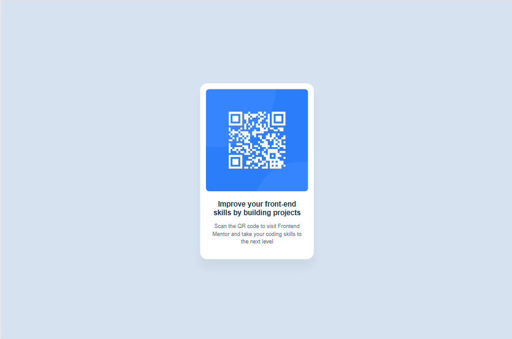

# Frontend Mentor - QR code component solution

## Table of contents

- [Overview](#overview)
  - [Screenshot](#screenshot)
  - [Links](#links)
- [My process](#my-process)
  - [Built with](#built-with)
  - [What I learned](#what-i-learned)
  - [Continued development](#continued-development)
  - [Useful resources](#useful-resources)
- [Author](#author)
- [Acknowledgments](#acknowledgments)

## Overview

### Screenshot

### Links

- Solution URL: [http://127.0.0.1:5500/index.html](http://127.0.0.1:5500/index.html)
- Live Site URL: [https://abdul-rahmannasser.github.io/Frontend-Mentor-QR-code-component/](https://abdul-rahmannasser.github.io/Frontend-Mentor-QR-code-component/)

## My process

### Built with

- normalize file
- google fonts
- Flexbox
- Media Query property

### What I learned

The most important thing that i learned from this project is how to dealing with figma and taking form it to make the design from coding and i am very happy to learned that.

### Continued development

The scale and box-shadow properties, media queries and flexbox.

### Useful resources

- [resource 1](https://www.w3schools.com/css/) - This helped me for understanding box-shadow and scale properties.
- [resource 2](https://necolas.github.io/normalize.css/) - This helped me for installing normalize file.

## Author

- Website - [Abdul-Ranman Nasser](http://127.0.0.1:5500/index.html)
- Frontend Mentor - [@Abdul-RahmanNasser](https://www.frontendmentor.io/profile/Abdul-RahmanNasser)
- Twitter - [@NasrAlstar](https://x.com/NasrAlstar)

## Acknowledgments

Thanks for who learn me HTML & CSS and i could do this projects from him, and thanks for who will help me to develop this project and discover the mistakes and improve this project.